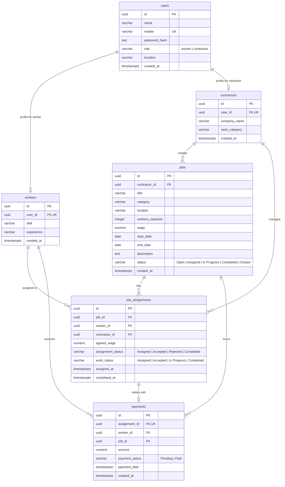

# KaamSetu Database Architecture & Setup Guide
**Team Role: Member 3 (Database Engineer)**  
**Technology:** Supabase (PostgreSQL), Node.js Client

---

## 1. Architecture & Entity-Relationship (ER) Diagram



---

## 2. Directory Structure

```
KaamSetu/
├── .env.example              # Template for Supabase URL and keys
├── .gitignore                # Protects .env from git leaks
└── database/
    ├── schema.sql            # Core DDL: extensions, tables, constraints, triggers, indexes, RLS
    ├── seed.sql              # Clean demo seed data (Rahul Patil, Amit Sharma, jobs, assignments, payments)
    ├── queries.sql           # 10 production SQL queries + lifecycle audit
    ├── supabaseClient.js     # Supabase client connector with env validation
    ├── dbService.js          # Helper functions for Member 2 (Express routes)
    ├── test-connection.js    # CLI verification tool for checking DB connectivity
    └── README.md             # This comprehensive documentation
```

---

## 3. Database Tables & Fields

### Table 1: `users`
Identity and credentials table for workers and contractors.
* `id` (`UUID`, PK, `DEFAULT gen_random_uuid()`)
* `name` (`VARCHAR(255)`, NOT NULL)
* `mobile` (`VARCHAR(15)`, NOT NULL, UNIQUE, length >= 10)
* `password_hash` (`TEXT`, NOT NULL)
* `role` (`VARCHAR(20)`, NOT NULL, CHECK `role IN ('worker', 'contractor')`)
* `location` (`VARCHAR(255)`, NOT NULL)
* `created_at` (`TIMESTAMPTZ`, NOT NULL, `DEFAULT NOW()`)

### Table 2: `workers`
1:1 extension table for workers.
* `id` (`UUID`, PK, `DEFAULT gen_random_uuid()`)
* `user_id` (`UUID`, NOT NULL, UNIQUE, FK → `users.id` ON DELETE CASCADE)
* `skill` (`VARCHAR(255)`, NOT NULL)
* `experience` (`VARCHAR(100)`, NOT NULL)
* `created_at` (`TIMESTAMPTZ`, NOT NULL, `DEFAULT NOW()`)

### Table 3: `contractors`
1:1 extension table for contractors.
* `id` (`UUID`, PK, `DEFAULT gen_random_uuid()`)
* `user_id` (`UUID`, NOT NULL, UNIQUE, FK → `users.id` ON DELETE CASCADE)
* `company_name` (`VARCHAR(255)`, NOT NULL)
* `work_category` (`VARCHAR(255)`, NOT NULL)
* `created_at` (`TIMESTAMPTZ`, NOT NULL, `DEFAULT NOW()`)

### Table 4: `jobs`
Job postings created by contractors.
* `id` (`UUID`, PK, `DEFAULT gen_random_uuid()`)
* `contractor_id` (`UUID`, NOT NULL, FK → `contractors.id` ON DELETE CASCADE)
* `title` (`VARCHAR(255)`, NOT NULL)
* `category` (`VARCHAR(255)`, NOT NULL)
* `location` (`VARCHAR(255)`, NOT NULL)
* `workers_required` (`INTEGER`, NOT NULL, CHECK `workers_required > 0`)
* `wage` (`NUMERIC(10,2)`, NOT NULL, CHECK `wage >= 0`)
* `start_date` (`DATE`)
* `end_date` (`DATE`)
* `description` (`TEXT`)
* `status` (`VARCHAR(50)`, NOT NULL, `DEFAULT 'Open'`, CHECK `status IN ('Open', 'Assigned', 'In Progress', 'Completed', 'Closed')`)
* `created_at` (`TIMESTAMPTZ`, NOT NULL, `DEFAULT NOW()`)
* Constraint: `CHECK (end_date IS NULL OR start_date IS NULL OR end_date >= start_date)`

### Table 5: `job_assignments`
Tracks assignments of workers to jobs, acceptance, and completion.
* `id` (`UUID`, PK, `DEFAULT gen_random_uuid()`)
* `job_id` (`UUID`, NOT NULL, FK → `jobs.id` ON DELETE CASCADE)
* `worker_id` (`UUID`, NOT NULL, FK → `workers.id` ON DELETE CASCADE)
* `contractor_id` (`UUID`, NOT NULL, FK → `contractors.id` ON DELETE CASCADE)
* `agreed_wage` (`NUMERIC(10,2)`, NOT NULL, CHECK `agreed_wage >= 0`)
* `assignment_status` (`VARCHAR(50)`, NOT NULL, `DEFAULT 'Assigned'`, CHECK `assignment_status IN ('Assigned', 'Accepted', 'Rejected', 'Completed')`)
* `work_status` (`VARCHAR(50)`, NOT NULL, `DEFAULT 'Assigned'`, CHECK `work_status IN ('Assigned', 'Accepted', 'In Progress', 'Completed')`)
* `assigned_at` (`TIMESTAMPTZ`, NOT NULL, `DEFAULT NOW()`)
* `completed_at` (`TIMESTAMPTZ`)
* Constraint: `UNIQUE (job_id, worker_id)` (Prevents duplicate assignment of the same worker to a job)

### Table 6: `payments`
Tracks wage settlements per assignment.
* `id` (`UUID`, PK, `DEFAULT gen_random_uuid()`)
* `assignment_id` (`UUID`, NOT NULL, UNIQUE, FK → `job_assignments.id` ON DELETE CASCADE)
* `worker_id` (`UUID`, NOT NULL, FK → `workers.id` ON DELETE CASCADE)
* `job_id` (`UUID`, NOT NULL, FK → `jobs.id` ON DELETE CASCADE)
* `amount` (`NUMERIC(10,2)`, NOT NULL, CHECK `amount >= 0`)
* `payment_status` (`VARCHAR(50)`, NOT NULL, `DEFAULT 'Pending'`, CHECK `payment_status IN ('Pending', 'Paid')`)
* `payment_date` (`TIMESTAMPTZ`)
* `created_at` (`TIMESTAMPTZ`, NOT NULL, `DEFAULT NOW()`)

---

## 4. Role Integrity & Exclusivity Triggers

To strictly enforce **"One user can have one worker profile OR one contractor profile"**:
- Trigger `trg_check_worker_role` validates that `users.role = 'worker'` and blocks creation if a contractor profile exists.
- Trigger `trg_check_contractor_role` validates that `users.role = 'contractor'` and blocks creation if a worker profile exists.

---

## 5. Row Level Security (RLS) & Protection

- RLS is **ENABLED** on all tables.
- The Node.js backend connects using `SUPABASE_SERVICE_ROLE_KEY` with full administrative access (`service_role` policies).
- For client/anon requests, safe granular policies are enabled.
- A database view `user_public_profiles` is provided to query user info without exposing `password_hash`.

---

## 6. Setup Instructions for the Team

### Step 1: Apply SQL in Supabase
1. Open your project on [Supabase Dashboard](https://supabase.com/dashboard).
2. Navigate to **SQL Editor** in the left sidebar.
3. Click **New query**, paste the entire contents of [`database/schema.sql`](file:///c:/Users/Vineet/KaamSetu/database/schema.sql), and click **Run**.
4. To load demo data, paste the contents of [`database/seed.sql`](file:///c:/Users/Vineet/KaamSetu/database/seed.sql) and click **Run**.

### Step 2: Configure Environment Variables
1. Duplicate `.env.example` to `.env`:
   ```bash
   copy .env.example .env
   ```
2. Retrieve your project URL and keys from Supabase Dashboard (**Project Settings → API**).
3. Fill in `.env`:
   ```env
   SUPABASE_URL=https://xxxxxxxxxxxx.supabase.co
   SUPABASE_ANON_KEY=eyJhbGciOi...
   SUPABASE_SERVICE_ROLE_KEY=eyJhbGciOi...
   ```

### Step 3: Backend Integration (For Member 2)
In the Node.js backend:
```bash
npm install @supabase/supabase-js dotenv
```

In your Express app or controllers:
```javascript
// Option A: Use the direct Supabase client
const { supabaseAdmin } = require('./database/supabaseClient');

// Option B: Use the pre-built KaamSetu service methods
const KaamSetuDB = require('./database/dbService');

// Example: Get open jobs
app.get('/api/jobs', async (req, res) => {
    try {
        const jobs = await KaamSetuDB.getOpenJobs();
        res.json({ success: true, data: jobs });
    } catch (err) {
        res.status(500).json({ error: err.message });
    }
});
```

### Step 4: Verify Connection
Run the connection tester:
```bash
node database/test-connection.js
```

---

## 7. Complete Demo Lifecycle Flow Support

| Step | Action | DB Operation |
|---|---|---|
| 1 | Contractor registers | `INSERT INTO users` (role: contractor) + `INSERT INTO contractors` |
| 2 | Contractor logs in | `SELECT ... FROM users WHERE mobile = ...` |
| 3 | Contractor creates job | `INSERT INTO jobs` (status: 'Open') |
| 4 | Contractor assigns worker | `INSERT INTO job_assignments` (status: 'Assigned') |
| 5 | Worker logs in | `SELECT ... FROM users WHERE mobile = ...` |
| 6 | Worker sees assigned job | `SELECT ... FROM job_assignments WHERE worker_id = ...` |
| 7 | Worker accepts job | `UPDATE job_assignments SET assignment_status = 'Accepted', work_status = 'Accepted'` |
| 8 | Work progresses | `UPDATE job_assignments SET work_status = 'In Progress'` |
| 9 | Work completed | `UPDATE job_assignments SET work_status = 'Completed', completed_at = NOW()` |
| 10 | Payment recorded | `INSERT INTO payments` (payment_status: 'Pending') |
| 11 | Contractor marks Paid | `UPDATE payments SET payment_status = 'Paid', payment_date = NOW()` |
| 12 | Worker sees Paid | `SELECT ... FROM payments WHERE worker_id = ...` |
